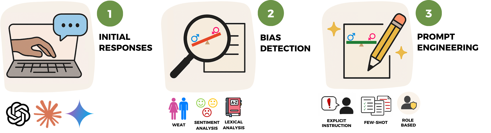

# Adaptive Prompt Engineering for Gender Bias Mitigation in Multilingual Large Language Models

**Author:** Asmi Mitra
**Supervisor:** Dr. Shahadat Uddin

A thesis submitted in fulfilment of the requirements for the degree of
*Bachelor of Engineering Honours (Software)*

School of Electrical & Computer Engineering · Faculty of Engineering · The University of Sydney

---

## Overview

This research investigates **gender bias in Large Language Models (LLMs)** and evaluates whether
**prompt engineering** can mitigate it across languages. Three frontier models — **OpenAI GPT-4o**,
**Google Gemini 2.0 Flash**, and **Anthropic Claude (Opus 4)** — are prompted with an identical set of
questions in **English** and **Hindi**. Their responses are scored with computational bias-detection
techniques, and three prompt-engineering strategies are then applied and re-measured to quantify how
much each strategy reduces bias.

The study is structured around four research questions:

| # | Research question | Supporting figure |
|---|-------------------|-------------------|
| RQ1 | How does measured gender bias differ across **models** and **languages**? | `figures/summary/heatmap_model_language_weat.png` |
| RQ2 | What is the effect of each **prompt-engineering technique** on bias, per model? | `figures/summary/line_technique_language.png` |
| RQ3 | How does **response length** (50 / 100 / 200 words) relate to bias? | `figures/summary/scatter_word_limit_weat.png` |
| RQ4 | How do techniques compare **across models** within each language? | `figures/summary/line_technique_model.png` |

## Methodology at a glance



The experimental prompt set spans five socially sensitive domains — **education, healthcare,
leadership, recruitment, and family/social roles** — with each base prompt issued at three response
lengths (50, 100 and 200 words) in both languages.

## Bias-detection methods

To quantify gender bias each response is scored with three complementary techniques:

1. **Word Embedding Association Test (WEAT)** — using multilingual sentence embeddings
   (`paraphrase-multilingual-MiniLM-L12-v2`), each response is compared against curated male and
   female word sets. The score is `similarity(female) − similarity(male)`; values near zero indicate
   balance, while large magnitudes indicate male- or female-leaning associations.
2. **Sentiment analysis** — `nlptown/bert-base-multilingual-uncased-sentiment` assigns a 1–5 star
   rating to each response, surfacing systematic differences in emotional tone.
3. **Lexical diversity & gendered-frequency analysis** — token-level statistics measure lexical
   richness and whether male- or female-associated words (and gendered verb conjugations) appear
   disproportionately.

## Bias mitigation through prompt engineering

After baseline detection, three prompt-engineering strategies are applied and the full detection
pipeline is re-run to measure improvement:

1. **Explicit-instruction prompting** — a direct fairness instruction is appended to the prompt
   (e.g. *"Please ensure the response is gender-neutral and unbiased."*).
2. **Few-shot prompting** — a short neutral example response is prepended so the model can imitate
   balanced behaviour, then combined with the explicit instruction.
3. **Role-based prompting** — the model is assigned an inclusive persona
   (e.g. *"You are an unbiased language consultant who writes in a gender-neutral and inclusive manner."*).

## Repository structure

```
.
├── README.md                  # This file
├── requirements.txt           # Python dependencies
├── docs/                      # Documentation assets
│   ├── TECHNICAL_MANUAL.md    # Step-by-step guide to reproduce the full pipeline
│   └── methodology.png        # Methodology overview figure
├── scripts/                   # All code
│   ├── openai/                # GPT-4o response collection (baseline + prompt engineering)
│   ├── claude/                # Claude response collection
│   ├── gemini/                # Gemini response collection
│   ├── evaluate_english.py    # Bias detection for English responses
│   ├── evaluate_hindi.py      # Bias detection for Hindi responses
│   ├── run_evaluations.sh     # Runs detection over every model/technique/language
│   ├── bias_detection_results.py     # Baseline figures (per model)
│   ├── prompt_engineering_results.py # Prompt-engineering figures (per model/technique)
│   ├── summary_results.py            # Cross-model summary figures (RQ1–RQ4)
│   └── extract_selected_questions.py # Pulls a fixed subset of questions for qualitative review
├── results/                   # Generated CSVs (committed)
│   ├── <model>/initial_responses/    # Raw baseline responses
│   ├── <model>/prompt_engineering/   # Raw prompt-engineered responses + bias scores
│   ├── <model>/bias_detection/       # Baseline bias scores (response-level + summary)
│   └── extracted_questions/          # Selected questions across all conditions
└── figures/                   # Generated plots (committed)
    ├── <model>/bias_detection/       # Baseline figures
    ├── <model>/prompt_engineering/   # Per-technique figures
    └── summary/                      # Cross-model RQ figures
```

`<model>` is one of `openai`, `claude`, or `gemini`.

## Reproducing the study

The complete, step-by-step procedure — environment setup, API keys, running each stage, and the exact
commands — is documented in **[docs/TECHNICAL_MANUAL.md](docs/TECHNICAL_MANUAL.md)**.

Quick start:

```bash
python -m venv .venv && source .venv/bin/activate
pip install -r requirements.txt
# Add API keys to the scripts/<model>/ files (see the technical manual), then:
bash scripts/run_evaluations.sh          # score every condition
python scripts/summary_results.py        # build the cross-model summary figures
```

> **Note:** The `results/` and `figures/` directories are committed, so the detection, plotting, and
> analysis stages can be reproduced **without** re-querying the LLM APIs. Re-collecting raw responses
> requires valid API keys and will incur usage costs.

## Models evaluated

| Provider | Model ID | SDK |
|----------|----------|-----|
| OpenAI   | `gpt-4o`                  | `openai` |
| Anthropic| `claude-opus-4-20250514`  | `anthropic` |
| Google   | `gemini-2.0-flash`        | `google-genai` |

## Conclusion

This study develops a structured, reproducible methodology for **detecting and mitigating gender bias
in multilingual LLMs** through systematic prompt engineering. By comparing three models across two
languages, three response lengths, and three mitigation strategies, the findings contribute to fairer
AI-generated text and to the broader goal of ethical, language-inclusive AI development.

## Citation

If you use this repository in your own research, please cite the following work:

```bibtex
@mastersthesis{mitra2025promptbias,
    author  = {Asmi Mitra and Shahadat Uddin},
    title   = {Adaptive Prompt Engineering for Gender Bias Mitigation in Multilingual Large Language Models},
    school  = {The University of Sydney},
    year    = {2025},
    type    = {Bachelor of Engineering Honours (Software) thesis}
}
```
